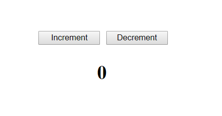
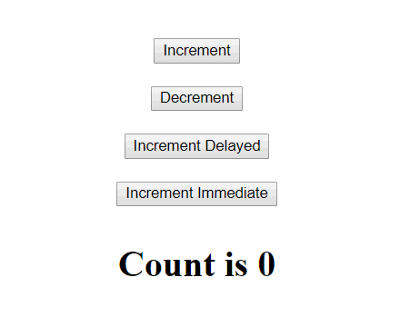
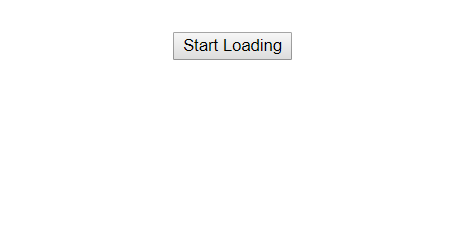
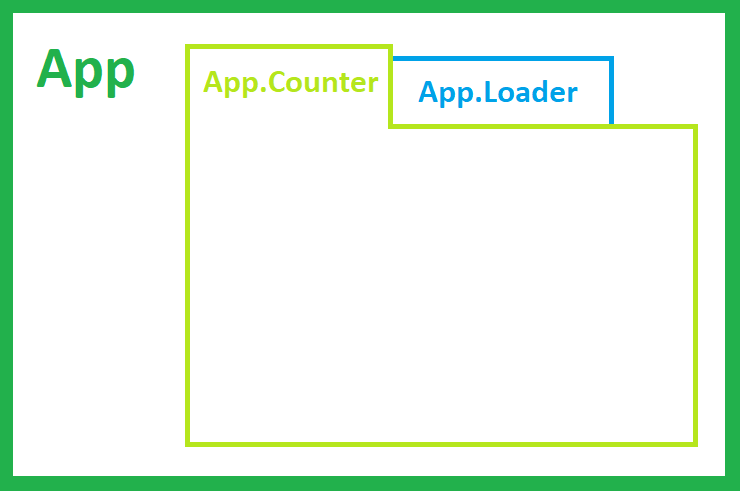

- title : Scaling Elmish Applications
- description : Introduction to the techniques of building largs elmish applications
- author : Zaid Ajaj
- theme : night
- transition : default

***

## Scaling Elmish Applications

 
 

### Introduction to the techniques of breaking down large elmish programs into smaller ones
 
 
Zaid Ajaj - [@zaid-ajaj](http://www.twitter.com/zaid-ajaj)

***

### Table of content

* Introduction
* Basics of Elmish 
* Concept of an "Elmish program"
* Importance of commands
* Larger programs 
* Challenges of breaking down programs
   - Breaking down parent state  
       - Keeping state of a single child program
       - Keeping state of all children programs
* Child programs 
   - State updates
   - dispatch 
   - commands
* Ongoing developement 
* Resources to learn more

***

### Introduction

***

### Basics of Elmish

    type State = { Count: int }

    type Msg = Increment | Decrement

    let init() : State = { Count = 0 } 

    let update msg state = 
        match msg with 
        | Increment -> { state with Count = state.Count + 1 }
        | Decrement -> { state with Count = state.Count - 1 }

    let view state dispatch = 
        div [ ] [ 
            button [ OnClick (fun _ -> dispatch Increment) ]
                   [ str "Increment" ]  
            button [ OnClick (fun _ -> dispatch Decrement) ]
                   [ str "Decrement" ]
            h1 [ ] 
               [ str (sprintf "%d" state.Count) ] 
        ]

***

***

***

### Introducing Commands

- Schedule async messages

***

***
    type Message = 
        | Increment 
        | Decrement 
        | IncrementImmediate
        | IncrementDelayed 

    // update : Message -> State -> State * Cmd<Message>
    let update msg state  = 
        match msg with 
        | Increment -> 
            let nextState = { state with Count = state.Count + 1 }
            nextState, Cmd.none 

        | Decrement ->
            let nextState = { state with Count = state.Count - 1 }
            nextState, Cmd.none

        | IncrementImmediate ->
            let nextCmd = Cmd.ofMsg Increment 
            state, nextCmd

        | IncrementDelayed -> 
            let nextCmd = Cmd.afterTimeout 1000 Increment 
            state, nextCmd

***

***

***

    type State = 
        | Initial
        | Loading 
        | LoadedData of message:string 
 
    type Message = 
        | StartLoading
        | ReceivedLoadedData of message:string
        | Reset

    let update msg state = 
        match msg with 
        | StartLoading -> 
            let nextState = State.Loading
            nextState, Cmd.afterTimeout 1000 (ReceivedLoadedData "Your data is here")

        | ReceivedLoadedData receivedMessage ->
            let nextState = State.LoadedData receivedMessage
            nextState, Cmd.none

        | Reset -> 
            let nextState = State.Initial
            nextState, Cmd.none

***

***
    let view state dispatch = 
        match state with 
        | State.Initial -> 
            makeButton (fun _ -> dispatch StartLoading) "Start Loading"
        
        | State.Loading -> 
            spinner 
        
        | State.LoadedData message -> 
            div [ ] 
                [ showMessage message
                  makeButton (fun _ -> dispatch Reset) "Reset" ] 
***

***

***

***

### Loading data from web api

    | LoadDrafts -> 
        let nextState = { state with Drafts = Loading }
        
        let loadDraftsCmd =
            Cmd.fromAsync { 
                Value = Server.api.getDrafts (SecurityToken(authToken))
                Error = fun ex -> DraftsLoadingError "Network error occured"
                Success = function 
                  | Ok drafts -> DraftsLoaded drafts
                  | Error authError -> AuthenticationError "User was unauthorized"
             }

        nextState, loadDraftsCmd

    | DraftsLoaded draftsFromServer -> 
        let nextState = { state with Drafts = Content draftsFromServer }
        nextState, Cmd.none

    | DraftsLoadingError errorMessage -> 
        let nextState = { state with Drafts = LoadError errorMessage }
        nextState, Cmd.none

***

***

### Combining the two programs

***

***
### Start with spaghetti
- Divide and conquer 
- Demo time!
  
***

***

### Data communication and updates

***

***

### Where to are messages dispatched?

***

***

### Division Patterns
- Keep state of all children   
- Keep state a single child

***

***

### Recommended Directory Structure 

***

***

### Design Principles

 - Child components don't know anything about their parents
 - Child components don't know anything about their siblings  
 - Parent components manage child states and communication between children

### Pro
- End up with modular application 
- isolated components are easier to reason with
- isolated components cannot change state outside of their "program"

### Cons 
- Explicit wiring of children with their parents 
- Explicit data communication between children

***

***

### But components are not always isolated!!!

- Communication between sibling components
- "Intercept and propagate" pattern
- Make distinction between "internal" and "external" messages

***

***

### Ongoing developement

- Fable & Fable.React bindings 
- Documentation
- Other platforms (Electron, React Native, Node.js, Cordova)
- Your help is needed: PRs are always welcome

***

***

### Resources to learn more

- Slides and apps used at https://github.com/Zaid-Ajaj/scaling-elmish-programs 
- Tabula-rasa project at https://github.com/Zaid-Ajaj/tabula-rasa
- fulma-demo at https://github.com/MangelMaxime/fulma-demo

### Starter templates 
- Hello world Fable project at https://github.com/Zaid-Ajaj/fable-getting-started
- Hello world Fable/Elmish project https://github.com/Zaid-Ajaj/elmish-getting-started

***